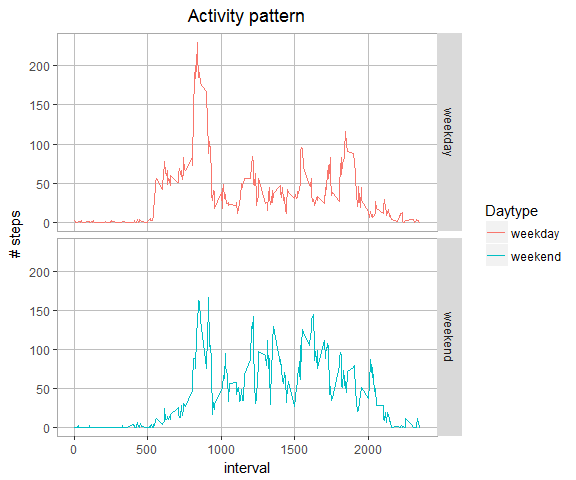

# Reproducible Research Course Project 1
Robert Ruiter  
21 february 2017  


# Introduction

This project is about analyzing data taken from an activity monitoring device such as [FitBit](http://www.fitbit.com/).
The data provided contains two months of steps taken in 5 minutes intervals each day from an anonymous individual.


## Getting the data

The data **activity.csv** was obtained from the Coursera website. The variables in the file are:

- **steps:** Number of steps taking in a 5-minute interval (missing values are coded as NA)
- **date:** The date on which the measurement was taken in YYYY-MM-DD format
- **interval:** Identifier for the 5-minute interval in which measurement was taken

The dataset is stored in a comma-separated-value (CSV) file and there are a total of 17,568 observations in this dataset.

### Loading and processing the data
First get the data:

```r
url <- "https://d396qusza40orc.cloudfront.net/repdata%2Fdata%2Factivity.zip"
fname <- "data/activity.zip"
download.file(url, fname, mode = "wb")
unzip(fname, exdir = "data")
```

Then read the data and convert variable date to date format:

```r
dfActivity <- read.csv("data/activity.csv", colClasses = c("numeric", "character", "numeric"))
dfActivity$date <- as.Date(dfActivity$date, "%Y-%m-%d")
```

### The mean total number of steps taken per day


```r
dfSteps.Total <- aggregate(steps ~ date, dfActivity, sum)
```

The mean of total steps is 10766.19.  
The median of total steps is 10765.00.  


```r
hist(dfSteps.Total$steps, 
     col = "grey", 
     main = "Variaton of Total Steps per Day", 
     xlab = "# Steps", 
     breaks = 25)
```


### The average daily pattern

Calculate the average steps taken per interval for each day.

```r
dfSteps.by.interval <- aggregate(steps ~ interval, dfActivity, mean)
```


```r
plot(dfSteps.by.interval$steps ~ dfSteps.by.interval$interval,
     type = "l",
     main = "Average Steps per Interval",
     xlab = "Interval",
     ylab = "Avg Steps")
```


Calculate which interval has the most steps taken:

```r
maxSteps <- dfSteps.by.interval[which.max(dfSteps.by.interval$steps), ]
```

The interval with the most steps taken is 835, that is 206 steps.

### Missing values

Check the dataset for missing values:

```r
sum(is.na(dfActivity$steps))
```


The number of missing values in variable **steps** is 2304, that's 13.1% of the total observations.

#### Imputing missing values

The number of missing values is quite high and has impact on the results. Therefore the missing values will be 'imputed'. For this the average of each interval over all days will be taken and imputed in the missing observations.
First copy the original data to a new dataframe, calculate the average steps per interval and impute that value in the missing interval:


```r
dfImputed <- dfActivity
x <- is.na(dfImputed$steps)
dfImputed$steps_imputed <- dfImputed$steps
dfImputed$steps_imputed[x] <- tapply(dfImputed$steps, dfImputed$interval, mean, na.rm = TRUE)

dfSteps.Total.Imputed = aggregate(steps_imputed ~ date, dfImputed, sum)
```


```r
hist(dfSteps.Total.Imputed$steps_imputed, 
     col = "grey", 
     main = "Variaton of Total Steps", 
     xlab = "# Steps", 
     breaks = 25)
```


* The mean of total steps is 10766.19.  
* The median of total steps is 10766.19.  
* The difference in total steps taken between the imputed and original data is 86130.

## Differences in activity patterns between weekend and weekdays

Add a factorvariable to the imputed dataset to compare the activity patterns.

```r
dfImputed$type.of.day <- as.factor(ifelse(format(dfImputed$date, "%w") %in% c(0, 6), "weekend", "weekday"))

dfSteps.by.interval.imputed <- aggregate(steps_imputed ~ type.of.day + interval, dfImputed, mean)
```


```r
g <- ggplot(dfSteps.by.interval.imputed, aes(interval, steps_imputed))
g <- g + geom_line(aes(color = type.of.day)) + 
    labs(color = "Daytype", title = "Activity pattern", y = "# steps") + 
    facet_grid(type.of.day ~ .) + 
    theme(plot.title = element_text(hjust = 0.5), 
          panel.background = element_rect(fill = "white"), 
          panel.grid.major = element_line(color = "grey"), 
          panel.border = element_rect(linetype = 1, fill = NA, color = "darkgrey"))
print(g)
```



